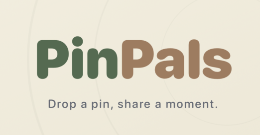

# PinPals 

PinPals is an iOS app that lets friends share location pins with each other on a live map. Users create an account, add friends, drop pins at meaningful places, and see only their friends' pins on a shared map.
 

---
 
## Table of Contents
 
- [Features](#features)
- [Tech Stack](#tech-stack)
- [Project Structure](#project-structure)
- [Prerequisites](#prerequisites)
- [Firebase Setup](#firebase-setup)
- [Running the Project](#running-the-project)
- [Architecture Overview](#architecture-overview)
- [Key Data Models](#key-data-models)
- [Firestore Collections](#firestore-collections)
- [Known Limitations](#known-limitations)
- [Contributors](#contributors)
---
 
## Features
 
- **Authentication** — Email/password sign up and login via Firebase Auth
- **Interactive Map** — Pan, zoom, and long-press to drop a pin anywhere
- **Pin Creation** — Add a name, comment, star rating (1–5), and category to any pin
- **Friends-only Feed** — The map shows only your own pins and your friends' pins
- **Friend System** — Search users by username, send/accept/reject friend requests
- **View a Friend's Pins** — Tap "View Pins" on any friend to filter the map to just their pins, with a one-tap banner to clear the filter
- **Location Search** — Search bar with live autocomplete powered by MapKit, drops a pin at any selected result
- **Pin Details** — Tap any pin to view its details, address (reverse geocoded), rating, and category
- **Pin Editing & Deletion** — Edit or delete your own pins from the detail sheet
---
 
## Tech Stack
 
| Layer | Technology |
|---|---|
| Language | Swift 5.9+ |
| UI Framework | SwiftUI |
| Maps | MapKit |
| Backend | Firebase (Firestore + Auth) |
| Minimum iOS | iOS 17 |
| Xcode | 15+ |
 
**Firebase packages used (via Swift Package Manager):**
- `FirebaseAuth`
- `FirebaseFirestore`
- `FirebaseCore`
---
 
## Project Structure
 
```
SocialLocations/
├── MapTab/
│   ├── MapView.swift              # Main map screen with search overlay and pin rendering
│   ├── Pin.swift                  # Pin data model + PinCategory enum
│   ├── PinViewModel.swift         # Firestore listener, pin CRUD, friend-filtered fetching
│   ├── SearchViewModel.swift      # MapKit autocomplete + search logic
│   ├── Location.swift             # Fixed landmark annotations (Capitol, Zoo, etc.)
│   └── Sheets/
│       ├── NewPinSheet.swift      # Sheet for creating a new pin
│       ├── InformationPinSheet.swift  # Sheet for viewing a pin's details
│       └── EditPinSheet.swift     # Sheet for editing an existing pin
│
├── FriendsTab/
│   ├── FriendsView.swift          # Friends list, search, and friend requests UI
│   ├── FriendsViewModel.swift     # Firestore listeners for friends and requests
│   └── FriendRequest.swift        # FriendRequest data model
│
├── ProfileTab/
│   ├── AppUser.swift              # AppUser data model
│   ├── AuthViewModel.swift        # Sign in / sign up state management
│   ├── LogInView.swift            # Login screen
│   ├── SignUpView.swift           # Account creation screen
│   ├── ProfileView.swift          # User profile display
│   └── ProfileEditView.swift      # Profile editing
│
├── Managers/
│   ├── AuthManager.swift          # Firebase Auth wrapper
│   └── FirestoreManager.swift     # Firestore read/write helpers
│
├── UI Design/
│   ├── AppBackground.swift        # Shared background view
│   ├── AppButtonsStyle.swift      # Custom button styles
│   ├── AppColors.swift            # App color palette
│   └── AppGeneralStyles.swift     # Shared modifiers and styles
│
├── MainView.swift                 # Root TabView (Map / Friends / Profile)
├── RootView.swift                 # Auth gate — shows Login or MainView
├── SocialLocationsApp.swift       # App entry point, Firebase.configure()
└── MapFilterState.swift           # Shared observable for friend pin filtering
```
 
---
 
## Prerequisites
 
- **Xcode 15 or later**
- **iOS 17 simulator or physical device**
- **A Firebase project** with Authentication and Firestore enabled (see below)
- **CocoaPods or Swift Package Manager** — this project uses SPM
---
 
## Firebase Setup
 
The app requires a valid `GoogleService-Info.plist` to connect to Firebase. This file is **not included in the repository** for security reasons. To get it running:
 
1. Go to the [Firebase Console](https://console.firebase.google.com/) and create a new project (or use an existing one).
2. Add an **iOS app** to the project. Use the bundle ID from Xcode: `com.yourteam.SocialLocations` (check your target's General tab for the exact ID).
3. Download the generated `GoogleService-Info.plist` and drag it into the `SocialLocations/` folder in Xcode. Make sure **"Copy items if needed"** is checked and the target is selected.
4. Enable **Email/Password** sign-in under Authentication → Sign-in method.
5. Create a **Firestore Database** in the Firebase console (start in test mode for development, then apply the rules below for production).
### Firestore Security Rules
 
```
rules_version = '2';
service cloud.firestore {
  match /databases/{database}/documents {
 
    match /users/{userId} {
      allow read: if request.auth != null;
      allow write: if request.auth != null && request.auth.uid == userId;
    }
 
    match /pins/{pinId} {
      allow read: if request.auth != null &&
        (resource.data.userId == request.auth.uid ||
         request.auth.uid in get(/databases/$(database)/documents/users/$(resource.data.userId)).data.friendIDs);
      allow create: if request.auth != null &&
        request.auth.uid == request.resource.data.userId;
      allow update, delete: if request.auth != null &&
        request.auth.uid == resource.data.userId;
    }
 
    match /friend_requests/{requestId} {
      allow read, write: if request.auth != null &&
        (request.auth.uid == resource.data.fromUserId ||
         request.auth.uid == resource.data.toUserId);
      allow create: if request.auth != null &&
        request.auth.uid == request.resource.data.fromUserId;
    }
  }
}
```
 
### Required Firestore Indexes
 
Firestore will prompt you with a link to create composite indexes the first time certain queries run. The ones needed are:
 
- `friend_requests` — composite index on `toUserId` + `status`
- `friend_requests` — composite index on `fromUserId` + `status`
- `users` — index on `usernameLower` (ascending range query for search)
---
 
## Running the Project
 
1. Clone the repository.
2. Open `SocialLocations.xcodeproj` in Xcode.
3. Add your `GoogleService-Info.plist` to the `SocialLocations/` folder as described above.
4. Swift Package Manager will resolve dependencies automatically on first open. If it doesn't, go to **File → Packages → Resolve Package Versions**.
5. Select a simulator (iPhone 15 or later recommended) or connect a physical device.
6. Press **⌘R** to build and run.
> **Note:** The app uses the device's location region to bias MapKit search results. The simulator defaults to Apple's Cupertino HQ — this is expected behavior.
 
---
 
## Architecture Overview
 
The app follows an **MVVM** pattern throughout:
 
- **Views** are SwiftUI structs that read from ViewModels and pass actions back via closures or bindings.
- **ViewModels** (`@ObservableObject`) own Firestore listeners and published state. Listeners are attached in `init()` or on `onAppear` and automatically push updates to the UI.
- **Managers** (`AuthManager`, `FirestoreManager`) are singletons that wrap Firebase SDK calls into clean completion-handler APIs.
- **`MapFilterState`** is a lightweight `ObservableObject` injected via the SwiftUI environment to let `FriendsView` tell `MapView` to filter pins for a specific friend without coupling the two views directly.
### Pin Filtering Flow
 
```
User taps "View Pins" on a friend
        ↓
FriendsView sets MapFilterState.focusedFriend
FriendsView sets selectedTab = 0
        ↓
MapView's onChange(of: mapFilter.focusedFriend) fires
PinsViewModel.listenToPins(friendIDs:) re-attaches with only that friend's ID
        ↓
Filter banner appears on map with ✕ to clear
```
 
---
 
## Key Data Models
 
### `Pin`
```swift
struct Pin: Identifiable {
    let id: String
    let coordinate: CLLocationCoordinate2D
    var name: String
    var address: String?
    var comment: String
    var rating: Int
    var category: PinCategory   // food, nightlife, nature, shopping, culture, education, other
    var userId: String
    var username: String?
}
```
 
### `AppUser`
```swift
struct AppUser: Identifiable, Codable, Equatable, Sendable {
    @DocumentID var id: String?
    let username: String
    let usernameLower: String   // used for case-insensitive search queries
    let phoneNumber: String
    let profileImageURL: String
    let email: String
    let friendIDs: [String]
}
```
 
### `FriendRequest`
```swift
struct FriendRequest: Identifiable, Codable {
    @DocumentID var id: String?
    let fromUserId: String
    let toUserId: String
    let status: String          // "pending" | "accepted" | "rejected"
    let createdAt: Timestamp
}
```
 
---
 
## Firestore Collections
 
| Collection | Document ID | Key Fields |
|---|---|---|
| `users` | Firebase Auth UID | `username`, `usernameLower`, `email`, `friendIDs` |
| `pins` | Auto-generated | `latitude`, `longitude`, `title`, `comment`, `rating`, `category`, `userId` |
| `friend_requests` | Auto-generated | `fromUserId`, `toUserId`, `status`, `createdAt` |
 
---
 
## Known Limitations

- **Firestore `in` queries** are capped at 30 items. Users with more than 29 friends will have their pins fetched in chunks — this is handled in `PinsViewModel` but worth noting.
- **Search** uses MapKit's local search completer and is biased toward the device's current map region. 
- **No push notifications** for friend requests, users must open the app to see pending requests.
---
 
## Contributors
 
| Name | Role |
|---|---|
| Bernarda Perez De Nucci | Built the map view, pin placement with long-press, fixed landmark annotations, and designed the app graphics and icon |
| Irene Gallini | Set up Firebase Auth and Firestore, built the full friends system including requests and real-time listeners, and wrote the ViewModels |
| Silas Revenaugh | Implemented MapKit search with autocomplete, the pin drop experience, all sheet flows, profile editing with profile pictures, and overall UI polish |
| Shahed Zahaykeh | Wrote the UI and unit test suite, built user search, and implemented pin editing and deletion |

 
---
 
*Built as a project for Software Design and Development, Macalester College, Spring 2026.*
 
